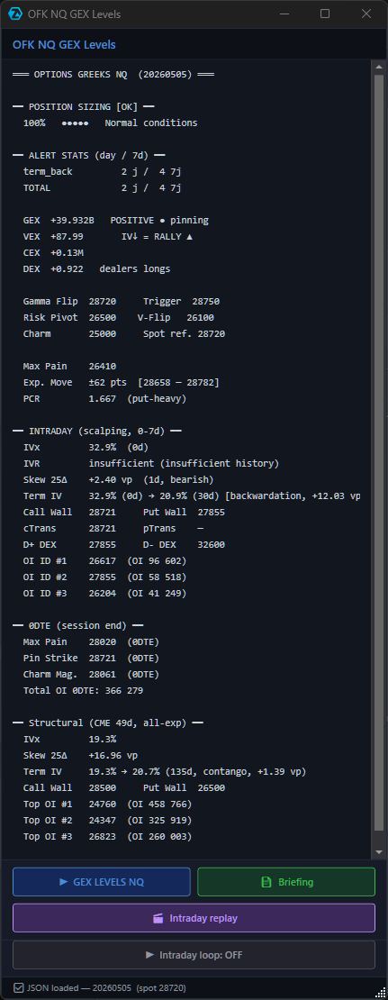

# OFK_Atas_GEX

ATAS indicators and Python pipeline for trading the E-mini Nasdaq-100 (NQ) and E-mini S&P 500 (ES) futures using options-derived levels (GEX, DEX, walls, gamma flip, pin strikes) and AI-generated daily briefings.

## What it does

- **Python pipeline** scrapes CME and CBOE option chains, computes Greeks Exposure levels (GEX, VEX, DEX, CEX), enriches with VIX and macro context, and writes a JSON file every 5 minutes during RTH.
- **ATAS indicators (C#)** read the JSON and draw the levels live on NQ/ES charts, with an on-chart context score, a floating panel, an intraday replay, and 12 alert types.
- **AI briefing** uses Claude to generate a daily JSON briefing with regime analysis, RTH plan (buy/sell zones, invalidations), and risk alerts. Rendered as a dark-theme A4 PDF.

## Quick install

**Required path**: the repository must end up at `C:\OFK_Atas_GEX\` (root of the C: drive).
The ATAS indicator default settings are pre-configured for this location. Installing elsewhere requires manual editing of indicator parameters in ATAS.

### Steps

1. Download the source ZIP from the [latest release](https://github.com/Kza56/OFK_Atas_GEX/releases/latest)
2. Extract it — you'll get a folder named `OFK_Atas_GEX-main`
3. **Rename it to `OFK_Atas_GEX`** and move it to `C:\` so you have `C:\OFK_Atas_GEX\`
4. Open PowerShell and run:

```powershell
# Copy the precompiled DLL to ATAS
Copy-Item "C:\OFK_Atas_GEX\dist\OFK_Atas_GEX.dll" "$env:APPDATA\ATAS\Indicators\" -Force

# Install Python dependencies
cd C:\OFK_Atas_GEX\OFK_GEX_Pipeline
pip install -r requirements.txt
playwright install chromium
```

5. Restart ATAS — indicators appear in the "Custom" category:
   - OFK NQ GEX Levels
   - OFK NQ Context Score
   - OFK ES GEX Levels
   - OFK ES Context Score

The precompiled DLL targets .NET 10 / Windows. No build tools required.

> **Building from source** (only if you modify the C# code): see [OFK_ATAS/README.md](OFK_ATAS/README.md).

## Daily usage

The package ships **two indicators that work together**: `OFK GEX Levels` (the levels and the floating panel) and `OFK Context Score` (a directional bias gauge). Both read the same `full_levels_*.json` produced by the Python pipeline.

### 1. GEX Levels — the floating panel and the buttons

Once `OFK NQ GEX Levels` (or its ES counterpart) is added to your chart, a floating panel summarizes everything you need for the session — and four buttons let you run the entire workflow without touching a terminal.

<p align="center">
  
</p>

#### Reading the panel

The top of the panel is a structured snapshot of the current session:

- **Header banner** — `OPTIONS GREEKS NQ` confirms the symbol and shows the trade date of the underlying option chain.
- **Position sizing** — Suggests a risk allocation level (`100% • • • • •` for normal, scaled down to `20%` in stressed regimes) based on VIX, blackout, and data freshness.
- **Alert stats** — Counts of triggered alerts today and over the last 7 days.
- **GEX / VEX / CEX / DEX block** — Aggregate dealer positioning. The label (`POSITIVE • pinning`, `NEGATIVE • amplifying`, etc.) is the regime headline.
- **Key structural levels** — Gamma Flip, Vol Trigger, Risk Pivot, Vanna Flip, Charm Magnet, Max Pain, Expected Move range, and PCR.
- **Intraday section (0-7 DTE)** — IVx/IVR/Skew/Term, Call Wall, Put Wall, cTrans/pTrans, D+/D- DEX, top OI strikes — the levels that matter most for scalping.
- **0DTE section** — End-of-session magnets (Max Pain, Pin Strike, Charm) plus total 0DTE OI.
- **Structural section** — CME 49d levels for the broader context.

#### The four buttons (no command line needed)

The bottom of the panel has four actions that run the Python pipeline directly from ATAS:

| Button | What it does |
|---|---|
| **GEX LEVELS NQ** | Runs the full morning pipeline (CME scrape + CBOE fetch + VIX/macro merge) and refreshes the JSON file the indicator reads. Use it once at the open, or any time you want to force-refresh. |
| **Briefing** | Opens the latest daily briefing PDF (regime analysis, RTH plan with buy/sell zones, risk alerts, one-line summary) generated by the AI agent. |
| **Intraday replay** | Opens a separate window where you can scrub through the day's intraday snapshots (one every 5 minutes) and see how the levels evolved through the session — useful for post-trade review and learning how the levels react to price action in real time. |
| **Intraday loop: OFF** | Toggles a 5-minute auto-refresh loop. When ON, the levels update continuously throughout the RTH session without further interaction. |

### 2. Context Score — the directional bias gauge

`OFK NQ Context Score` (or its ES counterpart) renders in a sub-pane below the chart. It collapses the entire dealer positioning picture into a single number between **−100 and +100** and explains *why* it landed there.


#### How to read it

The score has five buckets, each with its own color shown as a histogram bar in the sub-pane:

| Score range | Bucket | Color | Meaning |
|---|---|---|---|
| **≥ +70** | BULLISH HIGH | 🟩 bright green | Strong dealer positioning toward upside — squeeze territory above intraday Call Wall |
| **+30 to +69** | BULLISH | 🟢 soft green | Net bullish context — favorable to long scalps |
| **−29 to +29** | NEUTRAL | ⬜ light gray | No directional edge — pin strikes dominate, range plays |
| **−30 to −69** | BEARISH | 🟧 orange | Net bearish context — favorable to short scalps |
| **≤ −70** | BEARISH HIGH | 🟥 bright red | Strong dealer positioning toward downside — squeeze territory below intraday Put Wall |

Below the score, the indicator lists the **reasons** that drove it (e.g. `CW broke • GF+ • squeeze+`), so you can see at a glance which factors are dominant right now.

#### What goes into the score

Each contribution is signed and capped, then summed and clamped to [−100, +100]:

- **Position vs Call/Put Walls** (up to ±30) — Where spot sits relative to the wall cluster. Above intraday CW = bullish; below intraday PW = bearish.
- **Distance to Gamma Flip** (up to ±30) — Normalized by the day's expected move. Far above GF = stronger bullish; far below = stronger bearish.
- **Gamma regime tag** (±20, ±5) — `squeeze+`, `pos-gamma`, `neg-gamma`, `squeeze-` based on spot's location in the gamma map.
- **D+/D− DEX magnets** (up to ±15) — Pull from delta-positive or delta-negative dealer hedging zones.
- **Skew 25Δ** (−10 if extreme, −5 if elevated) — Heavy put hedging is a bearish tilt.
- **Term structure backwardation** (−5) — Acute stress signal.
- **Macro proximity** (±5) — Small drift toward whatever the recent macro momentum favors.

#### Blocking filters

When enabled (default), the score is **forced to 0** under three conditions:
- VIX is in the EXTREME regime (panic or vol crush)
- A high-impact macro event is within the next 30 minutes (blackout window)
- The pipeline data is stale or missing

The score also displays a small text overlay on the chart showing the live value and tag (e.g. `+51 [BULLISH]`).

### Power-user shortcut (optional)

If you prefer to run the pipeline from the terminal — for cron jobs, headless setups, or scripting — the same scripts are directly callable:

```powershell
cd C:\OFK_Atas_GEX\OFK_GEX_Pipeline
python run_morning_NQ.py
python run_morning_ES.py
python run_intraday_refresh.py NQ --loop --interval 300
```

## Documentation

- **[OFK_ATAS/README.md](OFK_ATAS/README.md)** — ATAS indicators reference (and how to build from source)
- **[OFK_GEX_Pipeline/README.md](OFK_GEX_Pipeline/README.md)** — Python pipeline reference
- **[OFK_GEX_Pipeline/GUIDE_GEX_LEVELS.md](OFK_GEX_Pipeline/GUIDE_GEX_LEVELS.md)** — Trader's guide to reading the levels (the most important doc for traders)
- **[docs/integration_handoff/](docs/integration_handoff/)** — Integration contract for external consumers (7 documents)

## Requirements

- Windows 10 / 11
- ATAS 1.5+
- Python 3.10+
- Claude Code CLI (`npm i -g @anthropic-ai/claude-code`) for AI briefings

## License

PolyForm Noncommercial 1.0.0 — see [LICENSE](LICENSE).

This software is free for personal, educational, and non-commercial use. Commercial use requires prior written permission from the author. Contact via GitHub issues.
